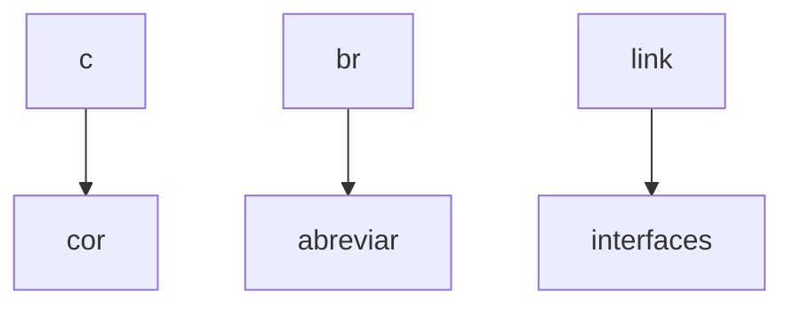
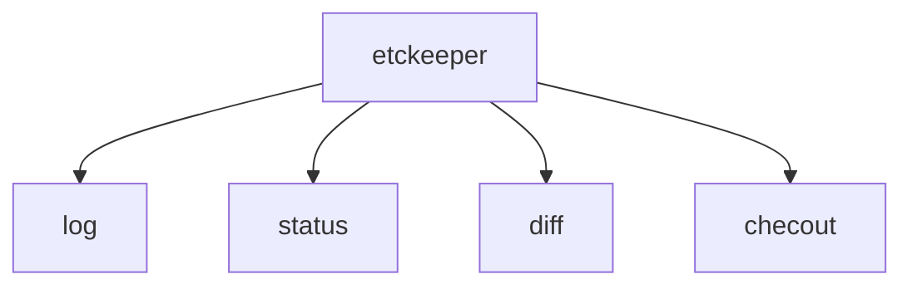

# Semana 25/04/2022

---------------

### Programa da disciplina:

* Instalar distro do linux para servidor ou contêines.
* Configuração de interfaces de rede.
* Instalação, configuração, uso e teste de serviços:
  * Servidor web (HTTP).
  * Servidor proxy e proxy reverso.
  * Servidor de registros (LOG).
  * Servidor de banco de dados.
  * Servidor de arquivos (FTP).
  * Servidor de autenticação.
  * Servidor de nomes e dominio (DNS).
  * Servidor de acesso remoto (SSH).
  * Servidor de contêines.
  * Servidor de configuração de dinâmica de hosts.
-----------  
### Alunguns programas intalados em aula no Windows:

1. WSL - Ubuntu, disponivel na loja microsoft.
2. Servidor apache.
3. Advanced port scanner.
-----------------
### Comando que julguei interesssante

Listar diretórios no powershell, semelhante ao comando do linux `ls`
```markdown
pwsh: dir
```
-----------


# Semana 02/05/22 e 09/05/22

----------------

### Alguns comandos aprendidos:

Listar interfaces de rede:
`ip -c -br link`
Filtra endereço ipv4 da máquina:
`ip -c -br -4 addr`


-----
Mostra endereço ip da máquina: 
`hostname -I`

Mudar o shell:
`chsh`
> Lembrar de especificar o shell que quer usar /bin/shell*

Lista todo conteudo do diretório atual inclusive os arquivos ocultos e enumera em uma lista:
`ls -FA1 | nl`

Executa o ultimo argumento passado:
`source $_`

-------
### Algumas extensões instaladas no VSCODE

```markdown
1. vscode icons.
2. markdown all in one.
3. markdown preview.
4. docs-markdown.

```
 -------

### Aplicações instaladas no linux

`ETCKEEPER + comandos`:


---------------------

`pip3`

---------------------