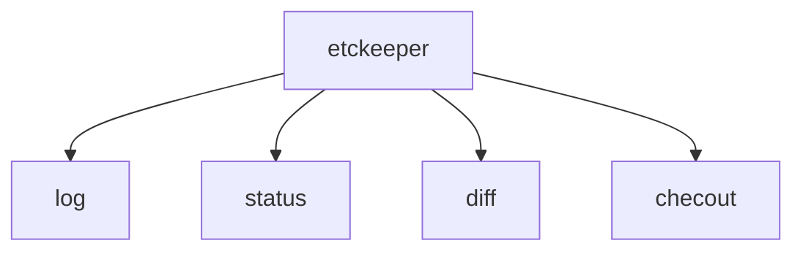

# Semana 25/04/2022

---------------

### Programa da disciplina:

* Instalar distro do linux para servidor ou contêines.
* Configuração de interfaces de rede.
* Instalação, configuração, uso e teste de serviços:
  * Servidor web (HTTP).
  * Servidor proxy e proxy reverso.
  * Servidor de registros (LOG).
  * Servidor de banco de dados.
  * Servidor de arquivos (FTP).
  * Servidor de autenticação.
  * Servidor de nomes e dominio (DNS).
  * Servidor de acesso remoto (SSH).
  * Servidor de contêines.
  * Servidor de configuração de dinâmica de hosts.
-----------  
### Alunguns programas intalados em aula no Windows:

1. WSL - Ubuntu, disponivel na loja microsoft.
2. Servidor apache.
3. Advanced port scanner.
-----------------
### Comando que julguei interesssante

Listar diretórios no powershell, semelhante ao comando do linux `ls`
```markdown
pwsh: dir
```
-----------


# Semana 02/05/22 e 09/05/22

----------------

### Alguns comandos aprendidos:

Listar interfaces de rede:
`ip -c -br link`
Filtra endereço ipv4 da máquina:
`ip -c -br -4 addr`


-----
Mostra endereço ip da máquina: 
`hostname -I`

Mudar o shell:
`chsh`
> Lembrar de especificar o shell que quer usar /bin/shell*

Lista todo conteudo do diretório atual inclusive os arquivos ocultos e enumera em uma lista:
`ls -FA1 | nl`

Executa o ultimo argumento passado:
`source $_`

-------
### Algumas extensões instaladas no VSCODE

```markdown
1. vscode icons.
2. markdown all in one.
3. markdown preview.
4. docs-markdown.

```
 -------

### Aplicações instaladas no linux

`ETCKEEPER + comandos`:


---------------------

`pip3`

---------------------


### Semana 17/05/2022

> Assunto: Nome da maquina, interface de redem e SSH (cliente e servidor)

**Chaves públicas e privadas (keygen)**
[Github](https://docs.github.com/pt/authentication/connecting-to-github-with-ssh/generating-a-new-ssh-key-and-adding-it-to-the-ssh-agent)
```markdown
ssh-keygen (id, id.pub)
ssh-copy-id USER@SERVER
```
------------
### Semana 24/05/2022

**Assuntos:** LXD/LXC, servidor ssh e serviços,
LXD: Daemon,
LXC: Cliente e comando


**Para checar os grupos ao qual seu usuário esta inserido:**
`$ groups USER` ou por exemplo `$ getent groups lxd` para obter informações de forma mais simples e objetiva. Use `newgrp` para aplicar as mudanças de grupo sem precisar fazer logoff.

**Comandos de gerenciamento e criação de conteines lxc/lxd**
```markdown
$: lxc list --help
$: lxc -c n4s
$: lxc launch images:ubuntu/22.04 NOME
$: lxc launch images:debian/11 NOME
$: lxc list images: | grep DISTRO
$: lxc launch images:alpinme/edge NOME
```

**Portas abertas do TCP**
```markdown
$: ss -tl
$: ss -tnl
```
**Portas abertas do UDP**
```markdown
$: ss ul
$: ss unl
```
**Configuração de interfaces de rede DEBIAN/ALPINE**
```markdown
$: /etc/network/interfaces
$: ifdown INTERFACE
$: ifup INTERFACE
```

**Configuração de interfaces UBUNTU/UBUNTU-SERVER**
```markdown
$: /etc/netplan/*yaml
$: netplan try
ou $ netplan apply
```

**Verificar informações sobre um pacote**
```markdown
$: apt show PACOTE
```
**Comandos para hora e data**
```markdown
$: date
$: timedatectl
```
**Aplicação para comparar arquivos**
```markdown
$: meld ARQUIVO-X ARQUIVO-Y
```

**Listar todas as portas TCP/UDP**
```markdown
$: sudo netstat -tulnp
```

**Instalar o code-server**
[Link para instalar](https://github.com/coder/code-server)

